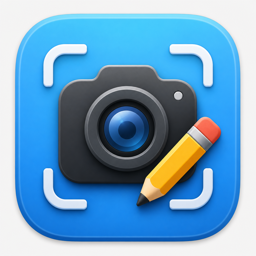

# Cappy

<p align="center">
  
</p>

Cappy is a native macOS menu bar app for fast screenshots and lightweight markup.
It captures regions, full displays, or individual windows, saves PNGs automatically,
and lets you annotate the latest capture with arrows, shapes, and text.

The project is intentionally small: SwiftUI for the interface, AppKit/CoreGraphics
where macOS integration is required, and no third-party dependencies.

## Features

- Region, full-screen, and window capture modes
- Global shortcuts:
  - `Shift` + `Command` + `5` for region capture
  - `Shift` + `Command` + `6` for full-screen capture
  - `Shift` + `Command` + `7` for window capture
- Native menu bar access for every capture mode
- Automatic PNG output to `~/Pictures/Cappy/`
- Floating post-capture thumbnail
- Annotation editor with arrows, rectangles, ovals, text, color picker, line width, undo/redo, and save
- macOS-style overlay, picker, thumbnail, and editor UI
- No external packages

## Requirements

- macOS 14 Sonoma or later
- Xcode 15 or later
- Swift 5.9 or later

## Build And Run

Clone the repository:

```bash
git clone https://github.com/leop25/Cappy.git
cd Cappy
```

Build with Swift Package Manager:

```bash
swift build
```

For day-to-day development, open the package in Xcode:

```bash
open Package.swift
```

Then select the `Cappy` scheme and run it on **My Mac**.

## Usage

Start Cappy, then use the menu bar icon or one of the global shortcuts.
Screenshots are saved immediately to:

```text
~/Pictures/Cappy/
```

After a capture, click the floating thumbnail to open the annotation editor.
Press `Command + S` to overwrite the saved PNG with the annotated version.

## Architecture

```text
Cappy/
├── CappyApp.swift
├── Models/
├── Services/
├── Views/
│   ├── Annotation/
│   ├── Capture/
│   └── MenuBar/
├── Utilities/
└── Resources/
```

Key implementation details:

- `MenuBarExtra` keeps the app lightweight and out of the Dock by default.
- Carbon hotkeys register global capture shortcuts without requiring Accessibility permission.
- Borderless AppKit windows provide the capture overlay and floating thumbnail.
- SwiftUI `Canvas` renders the annotation editor.
- CoreGraphics captures and PNG encoding keep the capture pipeline local and dependency-free.

## Current Status

Cappy is an early macOS utility. The core capture and annotation workflow is working,
but distribution packaging, preferences, and broader automated tests are still good
areas for future polish.

## Contributing

Issues and pull requests are welcome. Keep changes small, native, and dependency-free
unless there is a clear reason to expand the stack.

## License

MIT License. See [LICENSE](LICENSE).
